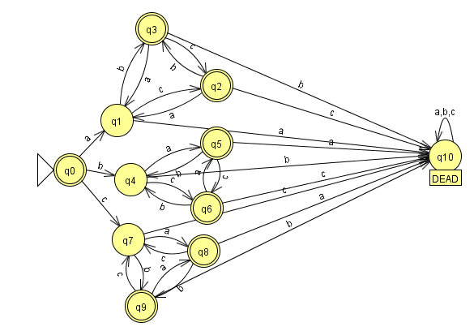

# DFA NonDup Letter #

This is DFA that read in a string consisting of any combination of characters
a b and c. This DFA will accept all strings whose starting and ending letter
are not the same and given any character in the string, its left and right
neighbor at the same as itself. See image below.

Created by unsignedzero (David Tran) originally on 09-26-2012 using
GHC v 7.4.1.

This code can be executed with runhaskell or manually loaded into ghci.
The main function to call is mod7.

# Version/Changelog #

* Image added.

## 1.1 05-20-2013 #
* Additional comments added to clarify the code.
* Readme converted to Markdown format and cleaned up.

## 1.0 10-09-2012 #
* Rather than print 0 or 1, true or false is printed, making it easier to read.

## 0.9 10-08-2012 #
* Bad inputs (those that contain letters that are not a b and c) return False
* Interactive main created.
* README created.

## 0.5 09-26-2012 #
* Original working code posted with image.
  Only works in GHCI as no main was created.
